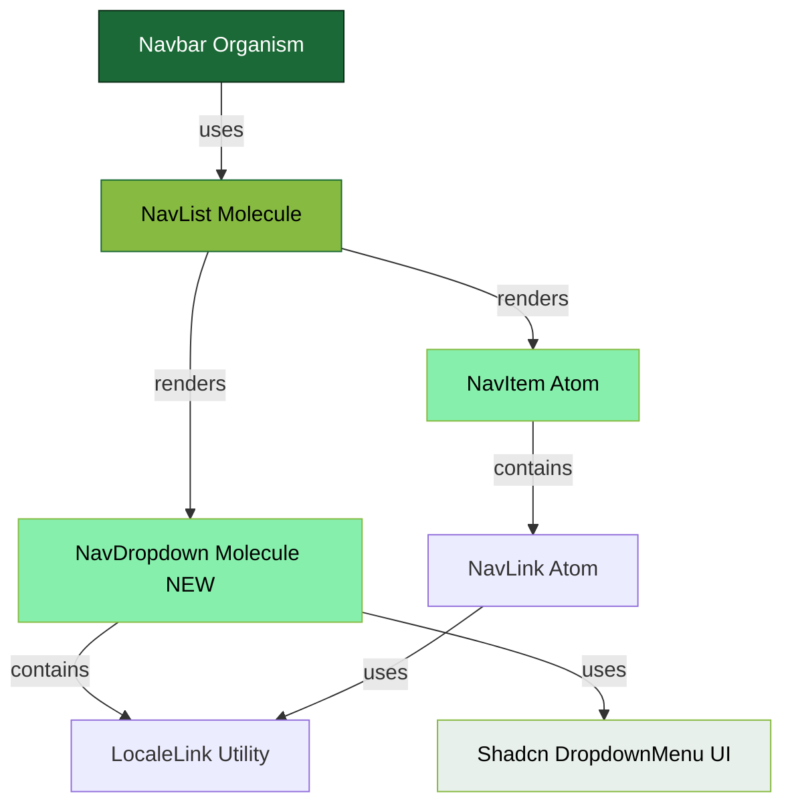
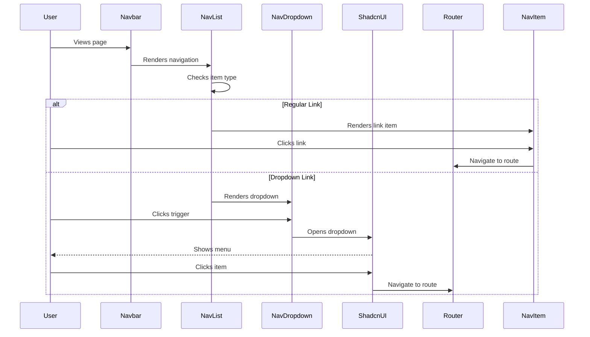
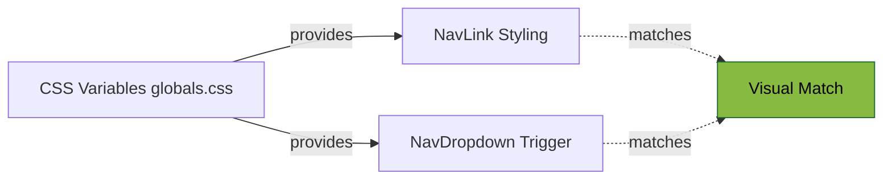

# Navbar Dropdown Architecture

## Component Hierarchy (Atomic Design)



## Data Flow



## Styling Architecture



## Component Responsibilities

### Organism: Navbar
- **Role:** Layout orchestrator
- **Responsibilities:**
  - Overall navbar structure
  - Background and dimensions
  - RTL direction
  - Component positioning
- **Changes:** None (zero breaking changes)

### Molecule: NavList
- **Role:** Navigation items container
- **Responsibilities:**
  - Iterate through navigation items
  - Decide which component to render (NavItem or NavDropdown)
  - Maintain spacing and alignment
- **Changes:** Added conditional rendering logic

### Molecule: NavDropdown (NEW)
- **Role:** Dropdown navigation item
- **Responsibilities:**
  - Render dropdown trigger with matching styling
  - Manage dropdown state via shadcn
  - Render dropdown menu items
  - Handle active state detection
  - Provide i18n support
- **Technology:** TypeScript + shadcn/ui

### Atom: NavItem
- **Role:** Single navigation link wrapper
- **Responsibilities:**
  - Wrap NavLink with list item
  - Pass props through
- **Changes:** None

### Atom: NavLink
- **Role:** Individual navigation link
- **Responsibilities:**
  - Active state detection
  - Styling and hover effects
  - Active underline indicator
  - Translation support
- **Changes:** None

## Active State Logic

### Regular Link (NavLink)
```javascript
isActive = 
  normalizedPath === normalizedHref || 
  (normalizedHref !== '/' && normalizedPath.startsWith(normalizedHref))
```

### Dropdown (NavDropdown)
```javascript
isAnyItemActive = items.some(item => 
  normalizedPath === item.href || 
  (item.href !== '/' && normalizedPath.startsWith(item.href))
)
```

**Result:** 
- If user is on `/services/eia`, the "Services" dropdown shows active
- Underline appears on the dropdown trigger
- Dropdown item "دراسات تقييم الأثر البيئي" is highlighted

## File Structure

```
src/
├── components/
│   ├── atoms/
│   │   ├── NavItem/
│   │   │   └── NavItem.jsx (unchanged)
│   │   └── NavLink/
│   │       └── NavLink.jsx (unchanged)
│   ├── molecules/
│   │   ├── NavList/
│   │   │   └── NavList.jsx (modified)
│   │   └── NavDropdown/  ← NEW
│   │       └── NavDropdown.tsx
│   ├── organisms/
│   │   └── Navbar/
│   │       └── Navbar.jsx (unchanged)
│   └── ui/  ← NEW (shadcn components)
│       └── dropdown-menu.tsx
└── lib/  ← NEW
    └── utils.ts
```

## Key Design Decisions

### Why TypeScript for NavDropdown?
- shadcn components are TypeScript
- Better type safety for dropdown items array
- Easier integration with shadcn primitives
- Can be imported and used in JSX files without issues

### Why Not Modify NavItem?
- Separation of concerns
- NavItem handles simple links
- NavDropdown handles dropdown logic
- Both are molecules at the same level
- NavList orchestrates both

### Why Keep Hardcoded Labels?
- Quick implementation with placeholders
- Can be easily converted to translation keys
- Maintains flexibility for future changes
- Real dropdown items will come from CMS/API

### Why Not Change Navbar?
- Zero breaking changes principle
- Navbar delegates to NavList
- NavList is responsible for navigation logic
- Clean separation of concerns

## Conclusion

The implementation successfully integrates shadcn dropdown menu into the existing Navbar while:
- ✅ Maintaining atomic design structure
- ✅ Preserving all existing functionality
- ✅ Matching visual design exactly
- ✅ Supporting RTL and i18n
- ✅ Zero breaking changes to parent components
- ✅ Following Next.js and React best practices

Ready for production use! 🎉
